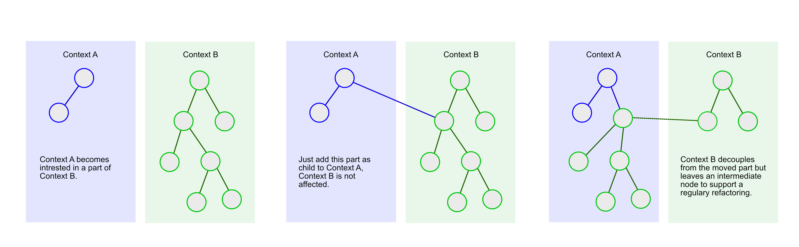
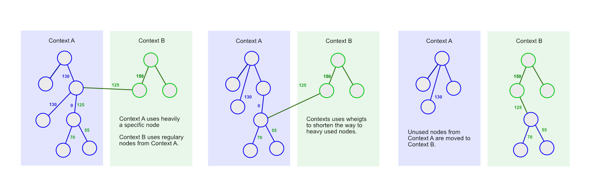

*current state of development: `pre-alpha`*  
*Tests will be refactored to ginkgo, but are not yet complete. The db init before tests is broken.*

# meshed

### Motivation

Program first.

Meshed ermöglicht es, Datenmodelle während der Entwicklung on the fly zu implementieren und ständig zu reorganisieren.
Die Entwicklung von Fachlichkeit bleibt frei von Kompromissen, die bei klassischer Vorgehensweise mit einem einmal 
festgelegtem Datenmodel die Weiterentwicklung oft einengen.

### Idee

Meshed organisiert Knoten in Baum- bzw. Netzstrukturen. Informationen sind diesen Knoten zugeordnet. 

Knoten können jederzeit verschoben oder umgehangen werden, ohne das sich die Struktur untergeordnet verbundener Knoten ändert.

Zusätzliche Knoten können mit bestehenden Strukturen verbunden werden und so neue fachliche Zusammenhänge abbilden.

Zusätzliche Regeln, die einem Knoten mitgegeben werden können, verhindern fehlerhafte Vernetzungen.

#### Warum, das kann ich doch auch mit relationalen Ansätzen problemlos darstellen?

Die Verbindungen von Knoten können als die Kanten eines Graphen interpretiert werden, die in Abhängigkeit von der Häufigkeit ihrer 
Benutzung mit Gewichten versehen werden. Diese Gewichte ermöglichen es, Knoten immer weiter in die Richtung ihrer
Aufrufer zu bewegen, ohne daß das auf den Knoten liegende Programm verändert würde. Das System würde sich in gewisser Weise
selbst optimieren. Die Konkrete Struktur der Daten bzw. der Knoten muss solches Verhalten natürlich unterstützen.

Dieses Verhalten auszuprobieren, war die eigentliche Motivation meshed vorzuschlagen und zu entwickeln.

### Vorteile von Meshed

- konkrete Implementationen von Programmen auf der Basis von Meshed unterscheiden sich nur über die enthaltenen Typen 
  und deren Regeln, die Art und Weise der Verknüpfung erfolgt immer gleich
- unabhängig von der verwendeten Datenbank (was in dem vorliegenden Prototypen leider noch nicht vollständig gelungen ist)
- die Informationen selbst sind typisiert und können ohne Kenntnis des Mesh verarbeitet werden 
- Knoten und ihre Informationen sind nach Typ persistiert und können schnell ohne Zugriff auf das Mesh direkt abgerufen 
  werden
- Knoten enthalten Metainformationen über die Informationen selbst (History), die unabhängig vom Entwickler erzeugt werden
- Knoten können Regeln über ihre möglichen Verknüpfungen enthalten, fehlerhafte Implementationen eines Mesh können bei 
  längerer Entwicklungszeit und wechselnden Teams vermieden werden

### Was leistet der Prototype

- Mesh und Nodes als Informationsträger sind beispielhaft implementiert
- beispielhaft wurden Informationen mit den Typen User, Image, Category implementiert
- Images können Usern zugeordnet werden, Images und User können mit Hilfe des Typs Category kategorisiert werden
- beispielhaftes Ändern der Informationen selbst, z.B. User, deren Name oder Passwort geändert wird
- beispielhaftes Veröffentlichen von Informationen über die im Mesh enthaltenen Typen und Abruf derer über eine Web-API
- beispielhaftes Registrieren von Usern über eine Web-API
- beispielhaftes Erzeugen von sehr einfachen Metainformationen (History) eines Knoten
- Verwendung von MongoDB als Persistenzschicht
- Verwendung von Mongo GridFS zur Ablage von Images

### Nachvollziehen der Funktionsweise

- zu jedem Typ und zur API wurden Tests implementiert
- mesh.db.property.ini.sample zu mesh.db.property.ini umbenennen, eine gültige Url zu einer MongoDB eintragen und im festgelegtem Pfad bereitstellen
- imagestream.db.property.ini.sample zu imagestream.db.property.ini umbenennen, eine gültige Url zu einer MongoDB eintragen und im festgelegtem Pfad bereitstellen
- Anwendung oder Tests mit dem Parameter '-inifiles "/path/to/propertyfiles"' starten
- Achtung, die Tests löschen vor dem Start Daten aus der Datenbank, eine separate Testdatenbank ist sinnvoll

Translate to english -> tbd.
